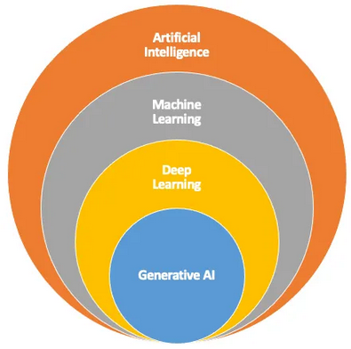
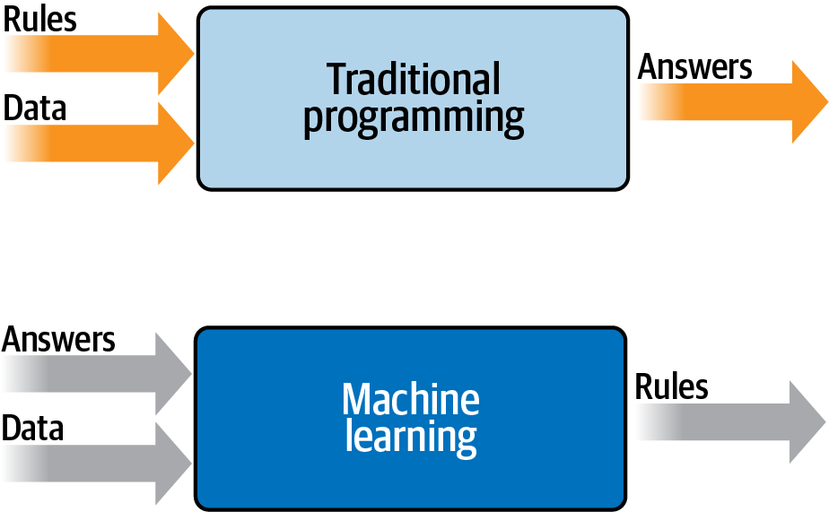

# **Part 0: Introduction to Data and Datasets for ML and LLMs**

In the ever-evolving field of **Artificial Intelligence (AI)**, **data** serves as the bedrock upon which all intelligent systems are built. Whether you are training a simple decision tree or deploying a state-of-the-art **Large Language Model (LLM)**, **high-quality, well-structured datasets** are the ultimate drivers of performance. 

Today, we will explore **why data is indispensable**, how it powers Machine Learning (ML) models, and its critical role in the complex lifecycle of training and fine-tuning LLMs.

> [!NOTE]  
> **The Paradigm Shift**
> Traditional programming requires humans to write explicit rules (e.g., `If X happens, do Y`). Machine Learning flips this paradigm: we provide the computer with **data and the desired output**, and the algorithm figures out the rules on its own. 

---

### **AI, ML, and the Evolution of LLMs**

To appreciate the sheer scale and importance of datasets, it is helpful to understand the "Russian Doll" architecture of AI—how **LLMs fit within the broader AI landscape**:

1. **Artificial Intelligence (AI)**: The broadest category, encompassing any system designed to simulate human intelligence and decision-making.  
2. **Machine Learning (ML)**: A subset of AI where models use mathematical algorithms to learn from data rather than relying on hard-coded rules.  
3. **Neural Networks (NN)**: A subset of ML inspired by the architecture of the human brain, using interconnected "nodes" to learn complex, non-linear patterns.  
4. **Deep Learning (DL)**: A more advanced subset of NN that leverages *multi-layered* architectures (deep neural networks) to achieve state-of-the-art performance on highly complex tasks.  
5. **Generative AI**: A specialized branch of DL focused on *generating net-new data*—whether that is text, images, or audio—based on learned patterns.  
6. **Large Language Models (LLMs)**: Massive deep learning models (like ChatGPT or Bing Copilot) trained on staggering amounts of text to understand, predict, and generate human-like language.  

<!--  -->

Unlike traditional programming, **ML systems infer patterns from vast amounts of data**. This makes **the quality, diversity, and volume of data** the ultimate bottleneck for success. Without high-quality datasets, even the most brilliantly architected models will fail to generalize and produce meaningful results.

<!--  -->

---

### **Why Data Matters in ML and LLMs**

At a fundamental level, every ML model relies on data to do three things:
*   **Learn patterns**: Identify hidden statistical relationships between inputs and outputs.
*   **Generalize**: Successfully apply those learned patterns to new, unseen examples in the real world.
*   **Improve over time**: Adapt to new information and edge cases through continuous training.

For **Large Language Models (LLMs)**, the data pipeline is significantly more complex and resource-intensive. 

<b> Deep Dive: How Data Powers LLMs (Pretraining to RLHF)</b>

LLMs don't just "read" data once; they go through distinct phases of data ingestion:
<ul>
  <li><b>Pretraining</b>: The model is fed huge, unstructured datasets (e.g., millions of books, articles, and code repositories). Here, it simply learns the grammar, facts, and structure of human language by repeatedly guessing the "next word" in a sentence.</li>
  <li><b>Fine-tuning</b>: The model is fed smaller, highly curated datasets to specialize in a specific domain. For example, feeding an LLM thousands of medical journals to turn it into a healthcare assistant.</li>
  <li><b>RLHF (Reinforcement Learning from Human Feedback)</b>: Humans review the model's outputs and rank them. This feedback data acts as a "reward system," teaching the model to be helpful, harmless, and polite.</li>
</ul>

> [!WARNING]
> **The Danger of Bad Data**
> Without structured, diverse, and heavily curated datasets, powerful AI architectures fall victim to **bias** (favoring certain groups unfairly), **misinformation** (repeating internet falsehoods), and **hallucinations** (confidently making up fake facts). Data curation is an ethical necessity, not just a technical one.

---

### **The Power of Open-Source LLMs**

The AI ecosystem is currently experiencing a massive shift toward **open-source LLMs**, such as [Sky-T1](https://github.com/NovaSky-AI/SkyThought),[Open-R1](https://github.com/huggingface/open-r1),[OLMo 2](https://allenai.org/blog/olmo2-32B), and DeepSeek-R1. 

By leveraging open-source models, we unlock critical advantages:
*   **Transparency**: You can inspect the code, understand exactly how the models are trained, and audit their safety.
*   **Cost-Effectiveness**: You avoid the exorbitant, recurring API licensing fees charged by closed-source providers.
*   **Customization**: You have the freedom to fine-tune the base model on your own proprietary datasets to achieve highly tailored performance.
*   **Community Collaboration**: You benefit from rapid, crowdsourced innovations shared across the global AI research community.

> [!TIP]
> **Domain-Specific Power**
> Imagine customizing an open-source LLM like **Sky-T1** entirely on legal contracts to automate paralegal work, or fine-tuning **DeepSeek-R1** on specialized biomedical papers to identify breakthroughs in medical research. Open-source puts the power of AI directly into your hands—**provided you have the right data to teach it.**

---

### **What to Expect in Today’s Lecture**

To fully leverage the benefits of AI, **we must first master the data that powers these systems**. Today's session is divided into two key parts:

1. **Part 1** – Understanding datasets for classical Machine Learning models, including how to clean, process, and engineer them.
2. **Part 2** – Exploring the massive scale, unique challenges, and specific formatting requirements for datasets used to train Large Language Models.

By the end of today's lecture, you will have a comprehensive understanding of **how datasets shape AI and ML models**, setting the perfect stage for future deep dives into training, fine-tuning, and evaluating your own LLMs.